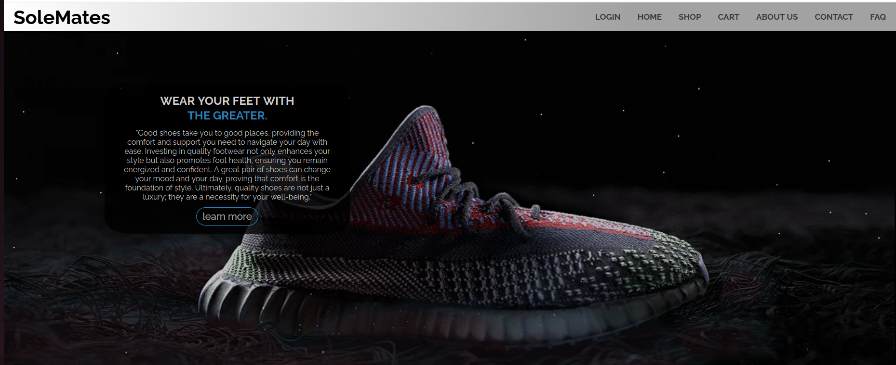

# 🛍️ E-Commerce Frontend

A responsive e-commerce frontend built using HTML, CSS, and JavaScript. It provides user-friendly interfaces for browsing products, managing cart items, and completing checkout processes.

---

## 🚀 Features

- 🏠 Homepage with product listings
- 🔐 User authentication (Login / Signup UI)
- 🛒 Add to cart functionality
- 📦 Checkout system
- 📱 Responsive design for different devices
- ⚡ Smooth UI interactions using JavaScript

---

## 🛠️ Tech Stack

- **Frontend:** HTML, CSS, JavaScript  
- **Styling:** Custom CSS  
- **Assets:** Images & static resources  

---

## 📂 Project Structure

```bash
.
├── css
├── imgs
├── auth.js
├── cart.html
├── cart.js
├── checkout.js
├── index.html
├── login.html
├── normalize.css
├── rellax.min.js
├── script.js
├── styles2.css
├── _redirects
└── README.md
```

---

### ⚙️ Setup & Usage
📥 Clone Repository
```bash
git clone https://github.com/SYEDMDSAAD/E-commerce-saad.git
cd E-commerce-saad
```
▶️ Run Project
Simply open: index.html

in your browser.

---

## 🌐 Live Demo
https://enchanting-faun-bc2adc.netlify.app/

---

## 📸 Screenshots
Add screenshots here:




---

## 📌 Pages Included
- index.html → Homepage
- login.html → Login page
- cart.html → Cart page
- Checkout handled via JavaScript

---

## 🤝 Contributing

Contributions are welcome! Feel free to open issues or submit pull requests.
⭐ If you like this project, give it a star!
